# Repaso de JavaScript 🖥️🧠

Para ejecutar código de JavaScript necesitamos una archivo de HTML:
1️ Podemos escribir el código de JavaScript en el mismo archivo HTML 1️

```html
<!DOCTYPE html>
<html lang="es">
    <head>
        <meta charset="utf-8"/>
        <title>Repaso JavaScript</title>
        <script>
            alert('hola a todos');
        </script>
    </head>
    <body>
        <h1>
            Aprendiendo JavaScript
        </h1>
        <p>Hola, soy Julián</p>
    </body>
</html>
```

<p align="center">
  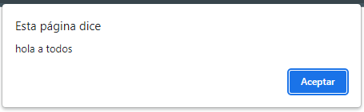
</p>

<p align="center">
  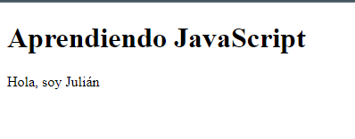
</p>

- o referenciamos el archivo de JavaScript que queremos usar:

```html
<!DOCTYPE html>
<html lang="es">
    <head>
        <meta charset="utf-8"/>
        <title>Repaso JavaScript</title>
        <script src="main.js" type="text/javascript"></script>
    </head>
    <body>
        <h1>
            Aprendiendo JavaScript
        </h1>
        <p>Hola, soy Julián</p>
    </body>
</html>
```

```javascript
alert('hola a todos');
```

Y funciona igual... <br />

Para crear variables en js seria:

```javascript
var nombre = "Julian Andres Núñez";
var altura = 170;
var concatenacion = nombre + " " + altura;
```

Para imprimir en la parte superior de la página HTML sería:
```javascript
document.write(nombre);
document.write(altura); //Pero pega junto todo :(
document.write(concatenacion); //La concatenación de lo anterior
```

<p align="center">
  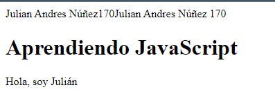
</p>

Pero una mejor forma de introducir cosas de JavaScript en el HTML sería agregando en el HTML un div con un id:
```html
        ...
        <div id="datos"></div>
        ...
```

Poner al final del body la importación de main.js en el archivo HTML:

```html
        ...
        <script src="main.js" type="text/javascript"></script>
    </body>
...
```

Y en main.js:

```javascript
var datos = document.getElementById("datos");
datos.innerHTML = concatenacion;
```

<p align="center">
  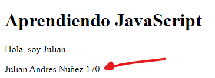
</p>

La otra forma que tenemos (usando el div y el id) que nos permite agregar HTML dinámicamente seria:

```javascript
var datos2 = document.getElementById("datos2");
datos2.innerHTML = `
    <h1>Estoy introduciendo HTML desde JS</h1>
    <h2>Mi nombre es: ${nombre}</h2>
    <h3>Mido: ${altura} cm</h3>
`;
```

<p align="center">
  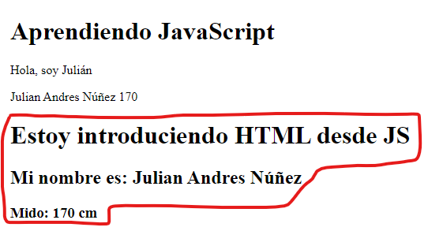
</p>

Un condicional que toma como criterio la edad sería:

```javascript
//Condicional (Vamos a agregar a lo anterior)
if(altura >= 190){
    datos2.innerHTML += '<h1>Eres una persona ALTA</h1>';
}else{
    datos2.innerHTML += '<h1>Eres una persona BAJITA</h1>';
}
```

<p align="center">
  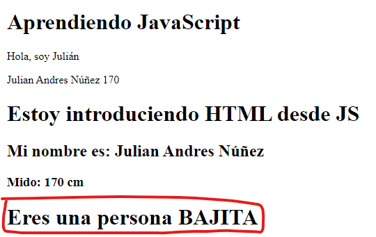
</p>

Un FOR normal para imprimir los números del 0 al 10 seria:

```javascript
for(var i = 0; i <= 10; i++){
    //bloque de instrucciones
    contador.innerHTML += "<h2>Número -> " + i; 
}
```

<p align="center">
  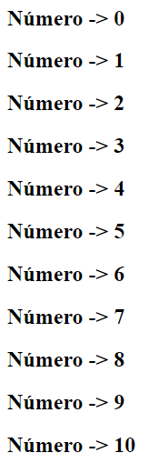
</p>


Para crear una función, en el archivo main.js ponemos:

```javascript
function muestraLaDescripcion(descripcion){
    var funcion = document.getElementById("funcion");
    funcion.innerHTML = `
    <h2>${descripcion}</h2>
    `;
}

muestraLaDescripcion("Recordando conceptos de JavaScript");
```

<p align="center">
  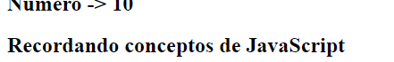
</p>

Función que llama a otra función:

```javascript
function entregaElNombre(nombre, altura){
    misDatos = `
        <h2>Mi nombre es: ${nombre}</h2>
        <h3>Mido: ${altura} cm</h3>
    `;

    return misDatos;
}

function imprimir(){
    var funcion2 = document.getElementById("funcion2");
    funcion2.innerHTML = entregaElNombre("Julian", 165);
}

imprimir();
```

<p align="center">
  
</p>

Arreglos:

```javascript
var nombres = ['Victor', 'Antonio', 'Joaquin', 'Kevin'];

document.write('<h3>Listado de nombres</h3>');
for(i = 0; i < nombres.length; i++){
    document.write(nombres[i] + '<br/>');
}
```

<p align="center">
  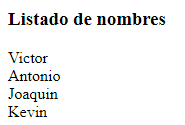
</p>

Otra forma de recorrer los arreglos seria:

```javascript
document.write('<h3>Con forEach</h3>');
nombres.forEach(function(nombre){
    document.write(nombre + '<br/>')
});
```

<p align="center">
  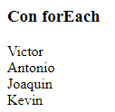
</p>

Última forma de recorrer los arreglos:

```javascript
document.write('<h3>Con flecha => </h3>');
nombres.forEach((nombre) => {
    document.write(nombre + '<br/>')
});
```

<p align="center">
  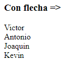
</p>
