# Aprendiendo React JS ⚛️

Primero, debemos tener instalado node. Lo comprobamos con:

```bash
node -v
```

Ahora creamos un proyecto de React JS con:

```
npx create-react-app .
```
(npx nos permite instalar un módulo de npm de forma global pero de forma temporal)

Después de finalizar la instalación de los paquetes:, nos muestra algunos comandos que podemos ejecutar:

<p align="center">
  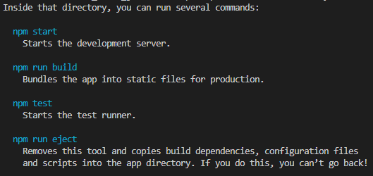
</p>

Además, nos crea varios directorios y archivos:

<p align="center">
  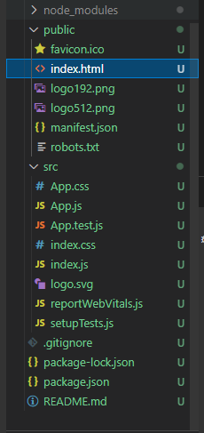
</p>

Ejecutamos el servidor de desarrollo:

```
npm start
```

Podemos consultar en [http://localhost:3000/](http://localhost:3000/) la página por defecto de React JS.

<p align="center">
  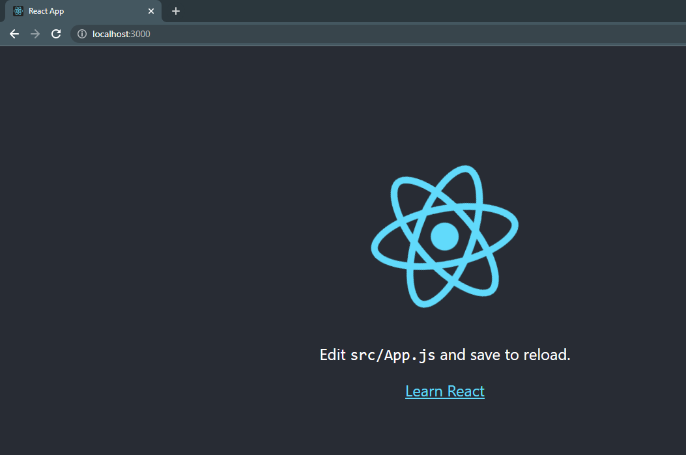
</p>

En public, encontramos a **index.html** que es la única plantilla que desplegará nuestra aplicación web (single web application):

<p align="center">
  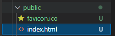
</p>

Contenido:

```html
<!DOCTYPE html>
<html lang="en">
  <head>
    <meta charset="utf-8" />
    <link rel="icon" href="%PUBLIC_URL%/favicon.ico" />
    <meta name="viewport" content="width=device-width, initial-scale=1" />
    <meta name="theme-color" content="#000000" />
    <meta
      name="description"
      content="Web site created using create-react-app"
    />
    <link rel="apple-touch-icon" href="%PUBLIC_URL%/logo192.png" />
    <!--
      manifest.json provides metadata used when your web app is installed on a
      user's mobile device or desktop. See https://developers.google.com/web/fundamentals/web-app-manifest/
    -->
    <link rel="manifest" href="%PUBLIC_URL%/manifest.json" />
    <!--
      Notice the use of %PUBLIC_URL% in the tags above.
      It will be replaced with the URL of the `public` folder during the build.
      Only files inside the `public` folder can be referenced from the HTML.

      Unlike "/favicon.ico" or "favicon.ico", "%PUBLIC_URL%/favicon.ico" will
      work correctly both with client-side routing and a non-root public URL.
      Learn how to configure a non-root public URL by running `npm run build`.
    -->
    <title>React App</title>
  </head>
  <body>
    <noscript>You need to enable JavaScript to run this app.</noscript>
    <div id="root"></div>
    <!--
      This HTML file is a template.
      If you open it directly in the browser, you will see an empty page.

      You can add webfonts, meta tags, or analytics to this file.
      The build step will place the bundled scripts into the <body> tag.

      To begin the development, run `npm start` or `yarn start`.
      To create a production bundle, use `npm run build` or `yarn build`.
    -->
  </body>
</html>
```
Y el único **div** que vemos, que tiene id **root**, será donde aparecerá todo el HTML que generamos con React JS:

<p align="center">
  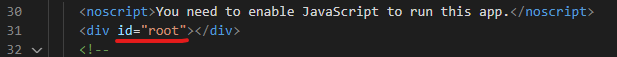
</p>

Borraremos todos los archivos del directorio **src** y crearemos un archivos llamado **index.js**:

<p align="center">
  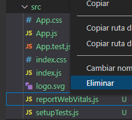
</p>

<p align="center">
  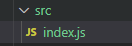
</p>

El archivo **index.js** contendrá:

```javascript
//Estas librerías ya vienen instaladas por defecto (ver package.json)
import React from 'react'; //Nos permitirá usar JSX (lenguaje parecido a HTML)
import ReactDOM from 'react-dom';

// El método render nos permite renderizar todos los elementos que hagamos en el HTML
ReactDOM.render(<div>hola mundo</div>, document.getElementById("root"));
```

Y al ejecutar **yarn start** (sí no tienen el administrador de paquetes YARN, lo instalan con **npm install -g yarn**) obtenemos:

<p align="center">
  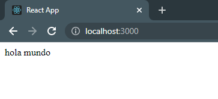
</p>

Vamos a hacer lo anterior (imprimir Hola mundo) pero usando una componente de React. Crearemos un nuevo componente llamado **App.jsx** (no hay diferencia sí le ponemos la extensión **js** o **jsx**, solamente es para hacer la distinción que es un componente de React):

<p align="center">
  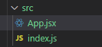
</p>

Esta componente contendrá:

```javascript
//COMPONENTE RAÍZ
import React from 'react';

// Creación de la componente App
// Recomendación: iniciar las componentes con mayúscula para diferenciarlas de una componente de HTML
export function App(){
    return <div>Hola mundo!!!</div>;
}
```

Y en el archivo **index.js** importamos esta componente y la renderizamos al HTML. Quedaria asi:

```javascript
//Estas librerías ya vienen instaladas por defecto (ver package.json)
import React from 'react'; //Nos permitirá usar JSX (lenguaje parecido a HTML)
import ReactDOM from 'react-dom';
import { App } from './App'; //Importamos la componente RAÍZ para renderizarla

// El método render nos permite renderizar todos los elementos que hagamos en el HTML
ReactDOM.render(<App />, document.getElementById("root"));
```

Lo que nos arroja el mismo **Hola mundo!!!**:

<p align="center">
  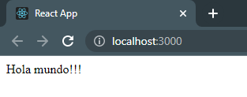
</p>

## Creación de una lista de tareas

Este ejemplo nos permitirá crear y eliminar tareas de una lista. Una vez creamos la tarea con un nombre dado, podemos marcarla como completada y viceversa. Las tareas que están completadas pueden ser borradas con un solo botón. También nos indica el número de tareas que faltan por completar:

<p align="center">
  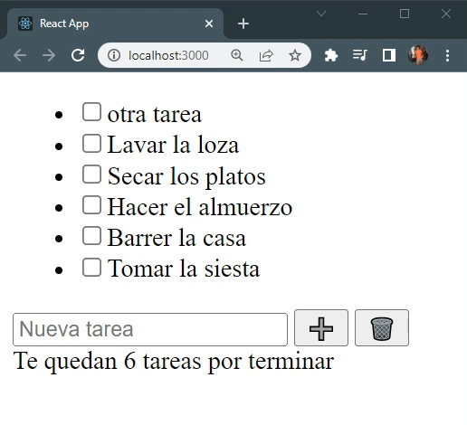
</p>

Crearemos una carpeta llamada **Components** dentro de src, y en él creamos dos archivos:

- TodoItem.jsx
- TodoList.jsx

<p align="center">
  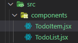
</p>

Vamos a crear el componente lista en **TodoList.jsx**. Para ahorrarnos código podemos escribir simplemente **rfc** y enter (esto es gracias al plugin **ES7+ React/Redux/React-Native snippets** de VSCode), lo que nos crea la estructura de una componente por defecto:

<p align="center">
  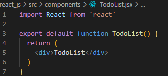
</p>

Le quitamos el default que tiene la función, y dejamos el archivo **TodoList.jsx** de la siguiente manera:

```javascript
import React from 'react';
import { TodoItem } from './TodoItem';

export function TodoList({ todos, toggleTodo }) { //Los atributos que llegan a la función son llamados "Props"
  return (
    <ul>
      {todos.map((todo) => (
        <TodoItem key={todo.id} todo={todo} toggleTodo={toggleTodo} />
      ))}
    </ul>
  )
}
```

Nuestro archivo **TodoItem.jsx** queda de esta forma:

```javascript
import React from 'react'

export function TodoItem({ todo, toggleTodo }) {
  const { id, task, completed } = todo;

  const handleTodoClick = () => { //Modifica el estado de "completed"
    toggleTodo(id);
  }; 

  return (
    <li>
      <input type="checkbox" checked={completed} onChange={handleTodoClick} />
      {task}
    </li>
  );
}
```

Y por último, nuestro componente principal **App.jsx** queda asi:

```javascript
//COMPONENTE RAÍZ
import React, { useState, Fragment, useRef, useEffect } from 'react'; // useState permite renderizar las componentes cada que se actualizan
import { TodoList } from './components/TodoList';
import { v4 as uuidv4 } from 'uuid';

// La KEY para guardar en el localStorage
const KEY = "todoApp.todos";

// Creación de la componente App
// Recomendación: iniciar las componentes con mayúscula para diferenciarlas de una componente de HTML
export function App() {
    
    // useState es un arreglo que devuelve 2 propiedades:
    // 1. El estado y 2. la función que modifica ese estado
    const [todos, setTodos] = useState([
        { id: 1, task: 'Tarea 1', completed: false },
    ]); 

    // Creación de la referencia que tiene el input de abajo, para que la podamos utilizar en el handle
    const todoTaskRef = useRef();

    // Para tener persistencia de los datos al recargar el sitio. useEffect nos permite gestionar el ciclo de vida
    // de la info dentro de la página
    
    // Este método se realiza al recargar la pagina (lo indica el arreglo vació), y traerá las
    // tareas guardadas en el localStorage
    useEffect(() => {
        const storedTodos = JSON.parse(localStorage.getItem(KEY)); // Para convertir de string a arreglo de objetos
        if(storedTodos){
            setTodos(storedTodos);
        }
    }, []);

    // Este método se realiza cada vez que se modifica el arreglo de Todos, y lo guarda
    useEffect(() => {
        localStorage.setItem(KEY, JSON.stringify(todos)); // stringify para guardar en formato JSON
    }, [todos]);

    // Función para que al marcar o desmarcar el "check" de la tarea cambie el estado de completado
    const toggleTodo = (id) => {
        const newTodos = [...todos]; // Creamos una copia del array
        const todo = newTodos.find((todo) => todo.id === id);
        todo.completed = !todo.completed; // Ponemos el estado opuesto
        setTodos(newTodos); // Ajustamos al nuevo array
    };

    //La función del onClick de abajo
    const handleTodoAdd = () => {
        const task = todoTaskRef.current.value //Tomamos el valor que tiene el input
        if(task === '') return;
        
        setTodos((prevTodos) => {
            return [...prevTodos, {id: uuidv4(), task, completed: false}]
        })

        todoTaskRef.current.value = null; //Para que deje en blanco el input una vez agregado
    };

    // Al presionar el botón de basura borra solo las tareas completadas
    const handleClearAll = () => {
        const newTodos = todos.filter((todo => !todo.completed)); //Va a tener todas las tareas que tenga no completado
        setTodos(newTodos)
    };

    return (
        <Fragment> {/* "Fragment" permite devolver un solo elemento (sustituto del div), 
                    tambien se puede usar las etiquetas vacias "<> </>"*/}
            <TodoList todos={ todos } toggleTodo={ toggleTodo }/>

            <input ref={todoTaskRef} type="text" placeholder="Nueva tarea" /> {/* Para leer de este input necesitamos 
                                                                                una referencia (ref), y la importamos */}

            <button onClick={handleTodoAdd}>➕</button> {/* onClick para que escuche cuando hacemos click en el botón y
                                                         que se ejecute una función */}

            <button onClick={handleClearAll}>🗑️</button>
            <div>Te quedan {todos.filter((todo) => !todo.completed).length} tareas por terminar</div>
        </Fragment>
    );
}
```
