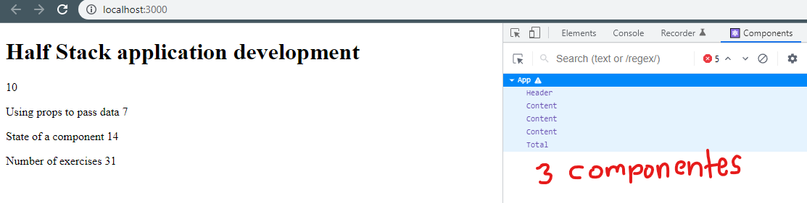
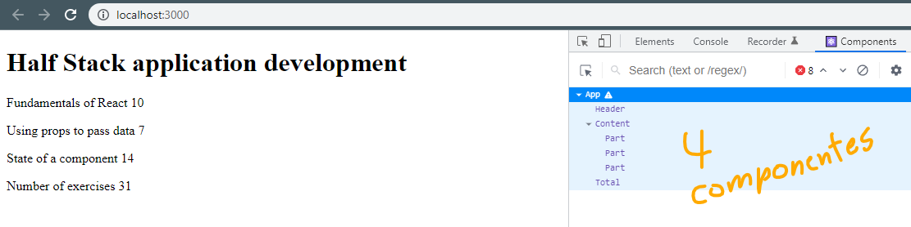

# Ejercicios de React JS planteado en esta página: [https://fullstackopen.com/es/part1/introduccion_a_react#ejercicios-1-1-1-2](https://fullstackopen.com/es/part1/introduccion_a_react#ejercicios-1-1-1-2)

## Ejercicio 1.1:

  

## Ejercicio 1.2:

  

